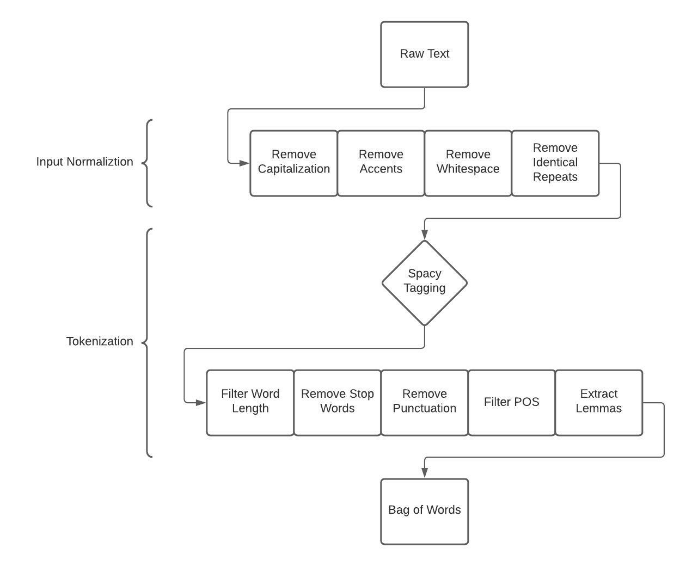
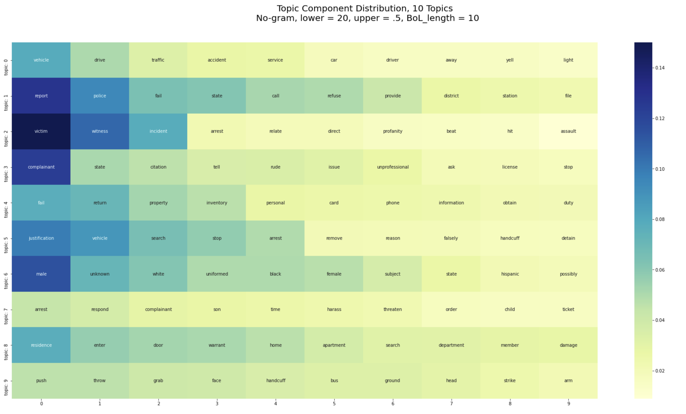
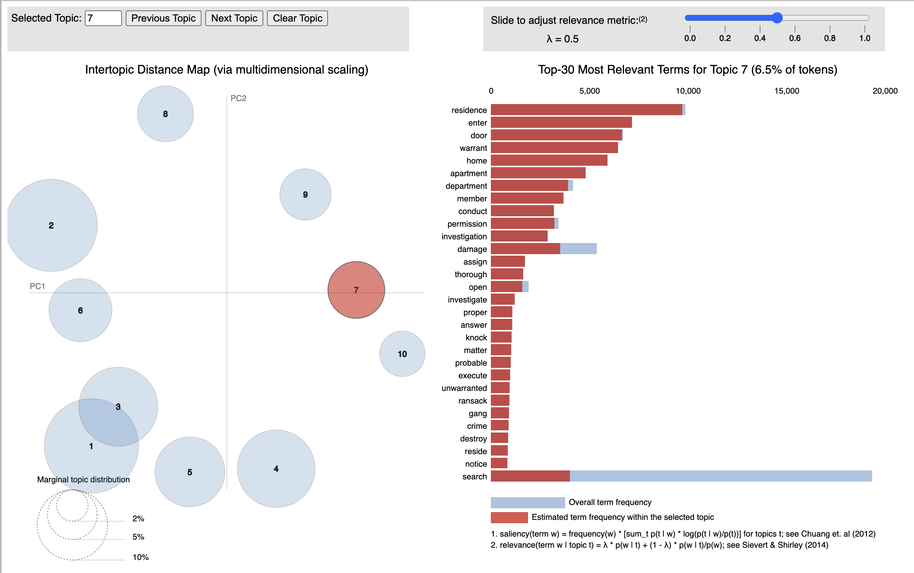

# Topic Modeling Police Misconduct Data — Project Status September 2021
## Introduction
Police misconduct has the effect of deepening the mistrust that can exist between communities and law enforcement.  This type of misconduct is not only detrimental to the victims immediately involved in the incident, but is consequential overall to public safety.  A systematic and transparent way of documenting misconduct complaints is a key tool in developing strategies to reduce police misconduct and crucial to the public interest.  Currently, complaints are usually handled internally by police departments.  Consequently, complaint severity, category, and the resultant disciplinary action are usually left to the discretion of the law enforcement organization. In our research we propose building a machine learning topic modeling system capable of processing raw police misconduct complaints in order to suggest alternative categorizations.  This system would be the foundation for an automated tool for auditing departmental misconduct decisions and allow for a searchable database of complaint records. Using misconduct complaints acquired from the Chicago Police Department, we are building out a text analysis pipeline for these types of unstructured data.  Additionally, we are currently in the process of acquiring data from more police departments nationwide, and ultimately hope to have a generalized, automated system for handling these types of complaints.
## Scope
For the first iteration of the project we are interested in a framework capable of baseline Latent Dirichlet Allocation (LDA) topic modeling of preprocessed textual data.  To this end we present a modular and customizable pipeline for preprocessing, modeling, and model evaluation.
## Data
For our analysis we are interested in the raw textual data from intake allegations.  Before processing, the data provided for this study is a series of police misconduct complaints that take the following structure:
| cr_id | pdf_name      | page_num      | section_name              | column_name               | text                   |     batch_id    | dropbox_path                                                                    | doccloud_url | 
|-------|---------------|---------------|---------------------------|---------------------------|------------------------|-----------------|---------------------------------------------------------------------------------|--------------|
|1049924|LOG_1049924.pdf|1              |Accused Members            |Initial / Intake Allegation| THE REPORTING PARTY, WHO DID NOT   WITNESS THE INCIDENT ALLEGES THAT   THE ACCUSED OFFICERS ENTERED   HER RESIDENCE AND SHOT HER DOG   WITHOUT JUSTIFICATION   REFERENCE: LOG# 1049919| 5               | /Green v. CPD FOIA Files/Raw documents from Green v CPD/Green 2020_09_25 Prod_7 |              | 
## Methodologies
The full modeling pipeline can be broken down into general steps: **preprocessing**, **model selection**, **model evaluation**, and **interpretation**.
### Preprocessing
**Preprocessing** consists of two primary components: **input normalization** and **tokenization**.  Due to the nature of the data, textual inputs vary significantly in their capitalizations and whitespace distributions.  Additionally many inputs have identically repeated texts or non-ascii characters.  During **input normalization** the goal is to make textual inputs as similar as possible while removing as minimal semantic information so as uniformily tokenize each input.

After textual inputs have been normalized, we hope to have constructed vectors for each entry using a **bag of words** representation.  Entries are streamed though a [spacy](https://spacy.io/) speech tagging pipeline which automates the **tokenization** process.  Furthermore spacy allows for the addition of several text processing modules in a more sophisticated implemntation of this model (spell check for example can be added to the spacy pipeline with out affecting the other preprocessing techniques as we improve).  Spacy's speech tagging is leveraged to filter stop words, punctuation, and other non-essential tokens.  Remaining tokens are lemmatized with spacy and appended to a list which is used to represent the entry.  After each entry has a corresponding **bag of words** representation, the corpus is processed using gensim's vectorizing module for easy input into its LDA modeling corpus.

### Modeling (LDA)

With documents represented as vectorized gensim objects, we can easily model our data using gensim's **LdaModel** module.  LDA discovers a specified number of topics by representing each topic as a distribution of contributing words.  A document's topic is thus determined by the most likely topic given it's combination of words.
After choosing hyper parameters that meet convergence requirements (we tweak chuncksize, passes, and iterations to get roughly full convergence on each chunk), the primary hyper parameter we explore is **num_topics** which specifies how many latent topics the model should define.   When deciding an optimal number of topics both the domain practicality and model performance must be taken into account.  A high performing model with 1000 topics is uninstructive, where as a poor performing model with a manageable 5 topics may be too vague.  Models were run with 5, 10, and 15 topics.
### Model Evaluation
The unsupervised nature of topic modeling present unique challenges for model evaluation.  Furthermore, given our specific context human auditing is necessary to determine what is a useful topic.  Below we present the 4 metrics for developing insights in to model performance and behavior.  While no single method is absolute, each offers a perspective into what the model is incentivized to find meaning in, and how those topics should be interpreted.
**Topic Coherence** is a technical metric for evaluating how good a topic is. The method determines evaluates a topic by measuring the similarity between high contributing words with in a specific topic.  When running a grid search a across several hyper parameters, topic coherence can be useful in determining the best model.
By looking **Topic Component Distributions** one can asses how good a model by determining how interpretable the topic distribution is to a human.  For example is a topic has high contributions from works like "traffic", "vehicle", "ticket", and "drive" one can reasonably conclude this topic is related to traffic violations.

We can visualize how topics are distributed using the **pyLDAvis** packages.  The module maps each topic into a two dimensional principal component space.  Similar topics will have little distance between them and vague topics will have a wide distribution.  Ideally a model will produce well distributed topics of similar specificity.
In order to assign human interpretation to each document, we consider the **Most Representative Documents** for each topic. Given a topic assignment, the most representative documents have the highest sum total of topic contributions for that topic.  By evaluating this topic one gains an understanding of what types of documents are designated to this topic and what the model is incentivized to measure.

## Findings/Conclusions

We were interested in testing 3 different preprocessing techniques (no-gram, bi-gram and tri-gram) against 3 different topic number hyper parameters (5, 10, 15) to yield 9 unique baseline models to evaluate.  The no-gram model with 10 topics gave  the most consistent and interpretable results.  The evaluation metrics are below:

### Topic Component distributions

### Principal Component Visualization

### Most Representative Documents

| Document_No | raw text   |
|-------|---------------|
| 2988  |The victim alleges that the accused officers   had no probable cause, arest warrant, or   search warrant to enter their residence   The victim alleges that the accused officers   had no   probable cause, arest warrant, or   search warrant to enter their residence.   The victim alleges that the accused officers   had no probable cause, arest warrant, or   search warrant to enter   their residence.   The victim alleges that the accused officers   had no probable cause, arest warrant, or   search warrant to enter their residence.   The victim alleges that the accused officers   h ad no probable cause, arest warrant, or   search warrant to enter their residence|
| 2987  |The victim alleges that the accused officers   had no probable cause, arest warrant, or   search warrant to enter their residence   The victim alleges that the accused officers   had no   probable cause, arest warrant, or   search warrant to enter their residence.   The victim alleges that the accused officers   had no probable cause, arest warrant, or   search warrant to enter   their residence.   The victim alleges that the accused officers   had no probable cause, arest warrant, or   search warrant to enter their residence.   The victim alleges that the accused officers   h ad no probable cause, arest warrant, or   search warrant to enter their residence|
| 2519  |ENTERED RESIDENCE WITHOUT   PERMISSION AND SEARCHED   RESIDENCE.   The reporting party alleges the accused   conducted an illegal search of his residence   in that they entered without   permission or   warrant.|
| 4552  |The Reporting Party alleged the accused   officers entered her home with a search   warrant and broke her front door, searched   and completely ransacked her apartment.|
| 33258  |that the accused failed to   indebtedness to the City of   accused failed to provide   debt to the human   and administration which   section E01-07, section IV-A-   that the accused   violated   she was disobedient of a   writing and orally.|

### Summary
Looking at the topic distribution we infer the following human interpretations for each topic.
| Topic Number | Topic Interpretation |
|--------------|----------------------|
| Topic_0      | Traffic/Moving Incident  |
| Topic_1      | Failure/Refusal to Provide Service  |
| Topic_2      | Physical Assault/Harassment  |
| Topic_3      | **Non-Specific**  |
| Topic_4      | Property/Inventory  |
| Topic_5      | Traffic/Moving Incident, Search  |
| Topic_6      | Racialized Interaction  |
| Topic_7      | **Non-Specific**   |
| Topic_8      | Search Warrant, Residence  |
| Topic_9      | Physical Assault Harassment  |

Notice how Topic 3 and Topic 7 were deemed to vague to assign a specific.  Topic 0 and Topic 5 both have large topic contributions from words that imply Traffic/Moving Incident.  The evaluation metrics above specifically show the breakdown for Topic 7.  The most representative documents for the topic corroborate the topic assignation for the most part.
### Next Steps
We have demonstrated a modular pipeline for preprocessing raw textual police accountability data and modeling it using gensims LDA module.  The most pressing improvements concern themselves with the preprocessing part of the work flow.  For example, the most representative documents for topic 7 indicates the model rewards entries with high buzz-word counts.  The result is high rankings for documents with lots of repeats.  Another improvement might involve leveraging the significant amount of meta-data attached to these entries to implement sophisticated models such as Structural Topic Modeling (STM).  Below is a non-exhausted list for more sophisticated techniques that have yet to be developed/implemented:
##### Preprocessing
- remove non-identical repeating phases
- spell checking
- rule based n-grams
##### Modeling
- Structural Topic Modeling
- More in-depth hyper parameter tunning (alpha and beta parameters)
- Hyper parameter tunning preprocessing techniques

At this point in the project we have built out a highly adapable and flexible pipeline for tokenizing raw textual inputs and running them through a baseline topic model.  Future iterations will focus on integrating more sophisticated preprocessing techniques into the current infrastructure and a more expansive model selection.