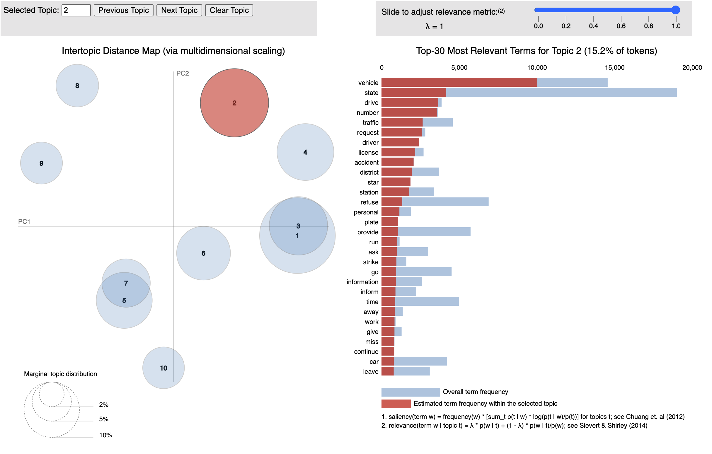

# pyLDAvis from LDA Model Development Notebooks

This folder contains pyLDA visualization produced by the models from the LDA model development notebooks.  Files can be downloaded and viewed as interactive html files. Below is a example screen shot for the visualization created by an LDA model with 10 topics and no-gram implementations.

